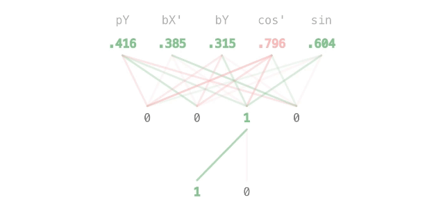

# Pong AI: Genetic algorithm in a browser

I was excited when I saw a genetic algorithm combined with a neural network in action for the first time and decided to try it myself! Also, for better understanding, I wanted to build a neural network from scratch without using AI libraries, just a little math.

As this is my first experience with AI, I planned to solve something that can be regarded as a classic task. I chose the Atari "Pong" concept as it was the first commercially successful video game. In this post, I want to share some notes I made during my journey.

### [Here is the DEMO!](https://iarthur.dev/pong-ai/)

You can play with the AI I've selected or even train your own and compare it to mine. It is mobile-friendly!

Also, [here is the source code.](https://github.com/realiarthur/pong-ai)

---

Hello! My name is Arthur Islamov, and I'm building the Micro Frontends Platform in exness. But today, I want to discuss a completely different topic. Let me describe in detail what I'm going to do here:

### Train AI to play Pong

- using a genetic algorithm
- using a simple, fully connected neural network
- from scratch with no AI libraries
- with digital inputs (pass values to AI, not screenshots)
- which can play both sides
- who is hard to beat
- with UI displaying the player population and the best player
- in a browser (client side)

_Yes, in a browser, using JS. There are no code examples in this article, and I don't want to start any holy wars. Of course, python's (or another language) math is better for AI. As a frontend developer, I am just more familiar with using JS. Moreover, the task doesn't seem intensive regarding processing, and the idea of training AI, for example, directly on a mobile device sounds tempting._

### What is all of this?

If you have never heard of Pong, it is a video game released in 1972 by Atari. The gameplay looks like this picture - two paddles return the ball back and forth. You can play it [here](https://www.ponggame.org/).

If you don't know what a fully connected neural network is, you might understand how it works after reading this article because I'll create one from scratch. Otherwise, here is a [good video explanation](https://www.youtube.com/watch?v=aircAruvnKk&t=694s) about it.

A genetic algorithm that I will use is an approach that lets the best-in-generation AIs create the next generation with mutations and so on until an acceptable individual is found. The first generation is generated randomly. You can find more information about it on [Wikipedia](https://en.wikipedia.org/wiki/Evolutionary_algorithm).

## Preparation

The first idea that popped into my mind about how to train the AI was to let it play with another AI and let those who win reproduce themselves with mutations and develop robust strategies. However, since the first generation of AIs is generated randomly, not all of them play well. First, we have to select those who look promising, better understand the game rules, and let their children improve their skills.

To make a proper selection, we need to:

- **Evaluate the player's behaviour** to let them know what we want and don't want from them. In terms of a genetic algorithm, it is called the fitness function. In our case, we can use score, as it is the only index of success in Pong:

ai fitness = ai score - enemy score

- **Put all players in the same conditions.** Selection by training them against each other can be a long process to create the same conditions for all players. It should be a round-robin tournament. Letting them fight with the same enemy in the training area is easier and faster.

### Training area

A training area could be presented as a "wall" player that bounces balls at random angles. Setting the minimum angle of the ball bouncing off the wall can increase the selection speed and should help select those who can handle complicated ball directions.

To prevent the AI from getting used to only large angles and losing the ability to react to balls with near-horizontal angles, I added the probability that a wall bounces every fourth ball at an angle below the established minimum.

_Training area. The "wall" player is on the left, and the distribution of the AI-controlled players' positions, with the highlighted best player, is on the right-hand side. A maximum of 25 sets are rendered._

### Gameplay

I won't dwell on the gameplay implementation, but I want to mention one aspect.

In the original Pong, the ball's previous direction is wholly ignored when bouncing, and only the paddle part that bounces the ball is considered. When I realised this, it almost spoiled my plan. It makes the game more enjoyable, but it means that I couldn't use the same ball for the entire player population.

Afterwards, I came up with the idea of training the AIs by sets. Each set contains its ball and players. All sets are almost transparent except the best one, which is gold. It lets you see the distribution of player positions and bounced or missed balls.

Now, everything is ready for the AI. Let's implement it!

---

## Neural network

For those familiar with how simple neural networks work, I want to describe only the essentials and below are several comments for those interested.

### Summary

- Five inputs

  - pY describes the AI's player Y position
  - bX' and bY describe the current ball position
  - cos' and sin describe the current ball direction

  - I did not want to train the AIs for different sides, but I wanted it to play well for both. If we take the X-axis's positive direction to be where the player sends the ball and 0 where the player is, this will solve the problem. I used the ' symbol for inputs that aligned with this rule
  - coordinates are scaled by the play table size

- One hidden layer of four neurons
- Two outputs: one to go up and one to go down. Stop if both are active
- Weights and biases between -1 and 1
- Step activation

_My neural network in action. Inputs are on top, and outputs are on the bottom. I use red for negative neuron and connection values and green for positive ones._

## Details (skip if you are familiar with NN or not interested in how to make it yourself)

If you are wondering what all of these things are, here is my attempt to describe what is needed to build a simple neural network.

### Outputs

Let's first imagine what we want to get from our neural network. Original Pong had a rotating knob controller, but I will work with my keyboard-controlled implementation. That means that moving speed is limited for the AI, and its paddle can be controlled by two signals: "up" and "down".

In that case, we only need these two values from the neural network. Both could be 0 or 1, which means the button isn't and is pressed, respectively. So, that is our output layer (at the bottom of the screencast). I'll describe how these values are calculated below.

### Inputs

Values about the player and the ball represent input neurons. They only describe the current state of the game to the next layer.

In my case, input values could be between -1 and 1. The AI knows nothing about what all those values mean, and it is its responsibility to figure it out.

### Hidden layer

Next, we have the hidden layer of four neurons to react to input data and make some conclusions that will be used for final decisions. The optimal number of neurons in the hidden layer is still mysterious to me, and I used the most common advice:

| "The optimal size of the hidden layer is usually between the size of the input and the size of the output layers."

All neurons _(except inputs here and below)_ are represented by their calculated **output value**. In the screencast, you can see that each neuron of the network is connected with each neuron from the previous layer, which means neuron output values are calculated based on the previous layer values using a few more parameters.

### Weights

Each connection between neurons is described by its **weight**. They allow neurons to decide which data from the previous layer should contribute more or less to their output value.

In my case, weights are presented by numbers between -1 and 1. Negative values are needed to allow neurons to "feel" the difference of specific parameters (e.g., ball position relative to player position) that are necessary for my task

In the screencast, all connections between neurons display (by opacity and colour) the degree of contribution of a neuron from the previous layer:

| [value from the previous layer] \* [connection weight]

All these contributions to the neuron's value add up to form a **weighted sum**.

### Activation function

At this moment, the AI already can somehow react to inputs considered its weighted sum. But the best that we can achieve now is what a friend of mine called the "Forrest Gump strategy":

"Follow the Y of the ball, no matter what" is an intuitive and robust strategy. But even if it may be hard to beat, even if some of the Pong AIs I have played use it, it isn't a smart strategy. Besides the cheating nature, this strategy has weaknesses at higher angles and speed. But the neural network can't do anything more intelligent now.

The reason is that we only consider the weighted sum to compute neurons' output values - just a sum of its inputs with coefficients or a linear transformation. An entire neural network consisting of only such neurons can only perform linear transformation. It's not so smart, but it's enough to follow the ball (subtract the ball's Y-position from the player's Y-position and go in the direction given).

To give neurons smarter decision-making ability, we should add a non-linear transformation, which an **activation function** can handle. This function transforms a given value to make it something more abstract than just a weighted sum of the input data.

There are many types of activation functions, but since my task is pretty simple and is about binary decision (go up or down), I'll use the simplest one - "step activation":

| if passed value > 0, the output value = 1, else 0

### Biases

If we pass a weighted sum to our activation function, we can already have some smarter decisions from the neurons. But sometimes, the decision (or neuron activation) should be offset from 0, which we use to compare the passed value.

Imagine the hypothetical, very simplified situation when a neuron wants to decide only one thing: whether or not the paddle is above the middle of the play table. The neuron, of course, needs to take the player's Y position (which is between 0 and 1) as an input. But to "feel" the middle, the neuron activation should be offset by 0.5:

| if (playerY - 0.5) > 0, the output value = 1, else 0

In neural networks, such an offset is called neuron **bias**, and it could be presented as any value between -1 and 1. It helps all neurons make even better decisions and, in my case, transforms the step function into a threshold function:

| if (weighted sum + bias) > 0, the output value = 1, else 0

Finally, we can calculate neuron activation. The value of every neuron in my network is computed using this rule.

### A few more words about weights and biases

Weights and biases are the central parts of neural networks. When we mutate our AI, we change these values a bit. "Randomly generated AI" means a neural network with random weights and biases. A "gene pool" of a population means collections of all weights and biases. The whole training process is about finding the correct values for them.

Now we can do the first launch!

## First launch

We should have sufficient randomly generated individuals in the first generation to have some desired traits in the "gene pool". It is unnecessary for future generations, so I decided to use a trick and make the first generation 3 times bigger than the population. Most of them will die quickly and won't affect further selection.

Let's set the population size to 1000 individuals (3000 in first generation) and finally launch the selection:

**On the right-hand side of the screen is information about the best AI player: its name, which includes its generation number, sibling index, and a picture of its brain function. Also, there is a "save" button that means keeping it for later comparisons with other AI or for playing with. Saved players are available under the "controller" select inputs above the play table, near the score.**

Not bad! Some of those randomly generated AIs look very promising - especially #1.601, which I saved for further comparison. You can play with it - it is a more or less skilled player.

Of course, the AI's strategies aren't perfect now. But imagine what we can achieve by targeted improvements of the best individuals! I'm too lazy to do it manually, so let's implement the environment.

---

## Environment

The idea of the environment is to automate the evolution process. The environment should let the AIs be selected, born, and die by themselves. There are several approaches to do this. I chose the following:

- set death threshold and let the AI die when its fitness value (that which is based on score) exceeds that threshold
- set a minimum limit number of surviving AIs and allow them to reproduce once the population reaches that limit

### Environmental changes

Of course, the desired death threshold is 0. But, since we train the AI in sets with their own ball, our process is more or less subject to luck, especially at the beginning. Compare:

- a player is not moving at all, and a few balls come at it without any actions from the player;
- a player tries to catch every single ball but misses some of them.

The last one looks more promising, but we can lose it if we set the death threshold as 0.

Another idea for the environment is to make it favourable at the beginning and more aggressive when new generations emerge. This will let us gradually nurture certain traits on the one hand and neutralise the influence of luck on the other. The environment should change by itself.

Thus, the death threshold can only be changed before an AI player's first death. Afterwards, this value will automatically decrease inversely to the current generation number. I have chosen the inverse proportion because it decreases quickly at the beginning and gradually at the end - exactly like I wanted.

### Reproduction

At the moment of reproduction, the individual copies itself with small random mutations (values between _-mutation_ and _+mutation_ current value) for each of its weights and biases. Free slots in the population are equally divided among all the survivors.

The parent score is reset, and it can try to survive again, perhaps in new conditions. It will allow us to keep good genes, even if the player does not belong to the current generation.

### Sibling number

Additionally, it would be interesting to see the number of AIs in each generation and the total number, as well as the progress and duration (in frames) of the current iteration. This information is shown under the "sibling number" section.

The gold label here shows the generation that contains the current leader. The oldest AI with the highest score is considered the leader because it has survived more situations. This does not affect the final selection and is for display purposes only.

### Final selection

It's possible to perform the final selection by setting the "number of survivors" to 0. If you do this, don't worry - the app will ask if you want to save the final AI standing.

Now, we can enjoy the spectacle of evolution:

The final selection was a real fight to the death! #44.1045 won, and I've saved it and compared it with #1.601 to see what the evolution gives us - that was a flawless victory!

#44.1045 and its fellow players from the final population look like professional goalkeepers, and this is the result that will make me happy for now! Try to [play with it](https://iarthur.dev/pong-ai/) and score at least one goal.

Of course, the AIs now only know how not to lose; they don't have any attack strategies. As I mentioned at the beginning of the article, I think it is possible to develop attack skills by training the AI by playing with other AI.

Maybe someday I'll implement this "round-robin tournament genetic algorithm". Then, each player of the final population selected in this article could be a proud participant.

---

## Appendix: mistakes and conclusions

Below, I've described a straightforward path to a result. But it wasn't so direct, as I'm used to learning by trial and error. The main conclusions I've made are **"Save the diversity"** and **"Don't micro-manage"**.

In the beginning, I had two faulty ideas:

- **I should tell the AI what's right.** I doubted that the score itself would encourage the AI to bounce the ball. Besides punishing for ball misses, I thought I should also stimulate players for bounces. So, my fitness function was based on stimulation points - I awarded the player points for desired behaviour and decreased it for wrong behaviour.
- **I should select those who pass the test and prove viability.** In other words, those who collected a certain number of stimulation points were considered as one of the parents of the next generation. At the same time, the possibility of dying remained to complete the iterations.

The idea of a stimulation score may not be bad in itself, but it is overkill for this task. However, the selection system, including both death and proof of viability, was confusing, and often it caused diversity reduction. That led to the point that the described above "Forrest Gump" strategy, with some modifications, spread to the entire population.

I got an idea for a smarter strategy: go to the middle of the table in the offensive phase and try to predict the ball position in the defensive phase. I decided to use "stimulation" to nurture it, and this became my next pitfall - it didn't help because the faulty selection was the root cause.

When I fixed the selection system as described in the article, the AI itself could find the right actions and strategy. I realised that there was no need to develop every desired trait. **It's better to focus on creating the right environment and setting only the general goal.** For me, this takeaway has become a deep one that goes beyond the scope of this article!
